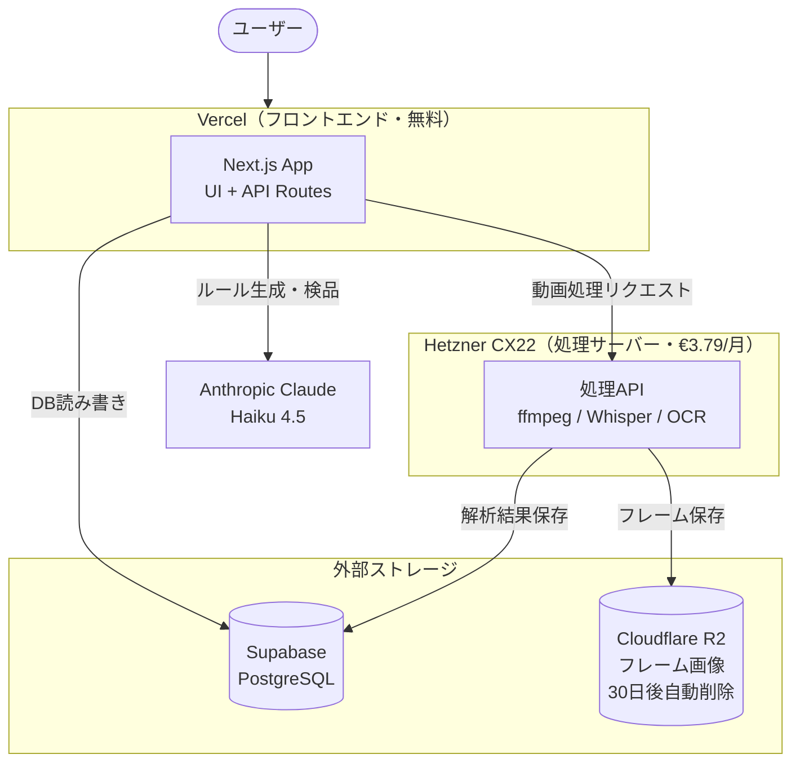

# VideoRule Forge

**AI動画検品 — 動画制作ルールを育てるプラットフォーム**

お手本動画やガイドラインから自社の動画制作ルールを蓄積し、新規動画を自動検品するWebアプリケーションです。

---

## システム構成



### コンポーネント一覧

| コンポーネント | 役割 | コスト |
|---|---|---|
| Vercel | Next.js ホスティング・CDN | 無料 |
| Supabase | PostgreSQL データベース | 無料（500MB まで） |
| Hetzner CX22 | 動画処理（ffmpeg・Whisper・OCR・yt-dlp） | €3.79/月 |
| Cloudflare R2 | フレーム画像ストレージ（30日後自動削除） | 10GB まで無料 |
| Anthropic Claude | ルール候補生成・動画検品 AI | 従量課金 |

---

## 機能

- **知識ソース登録**: お手本動画（ファイルアップロード）・ガイドライン文書（PDF/Word/テキスト）
- **Stage 1 解析**: ffprobe でメタデータ取得 → ffmpeg でフレーム抽出 → Tesseract でOCR → Whisper で音声文字起こし
- **Stage 2 解析**: Claude がルール候補を自動生成
- **ルール管理**: 候補レビュー・承認・編集・バージョン管理
- **動画検品**: 検品動画をルールセットで自動評価
- **SNS動画取得**: yt-dlp 経由（要 `ENABLE_SNS_DOWNLOAD=true`、初期は無効）

---

## ローカル開発

### 前提条件

```bash
# macOS
brew install ffmpeg tesseract tesseract-lang yt-dlp

# Node.js 20+
node -v
```

### セットアップ

```bash
git clone https://github.com/otsuyu1025/videorule-forge.git
cd videorule-forge

cp .env.local.example .env.local
# .env.local を編集して ANTHROPIC_API_KEY を設定

npm install
npm run dev
```

ブラウザで [http://localhost:3000](http://localhost:3000) を開く。

---

## Docker でのセットアップ（Hetzner VPS）

### 1. サーバー準備（Ubuntu 24.04）

```bash
# Docker + Docker Compose インストール
curl -fsSL https://get.docker.com | sh
apt-get install -y docker-compose-plugin
```

### 2. アプリデプロイ

```bash
git clone https://github.com/otsuyu1025/videorule-forge.git
cd videorule-forge

cp .env.local.example .env.local
# .env.local を編集（必須項目を設定）

docker compose up -d
```

### 3. 死活監視（UptimeRobot・無料）

[uptimerobot.com](https://uptimerobot.com) に登録後：

1. **Add New Monitor** をクリック
2. Monitor Type: `HTTP(s)`
3. Friendly Name: `VideoRule Forge`
4. URL: `http://{サーバーIP}:3000/api/health`
5. Monitoring Interval: `5 minutes`

ダウン時にメールで自動通知されます。

### 4. コンテナ管理コマンド

```bash
docker compose ps           # 状態確認
docker compose logs -f      # ログ確認
docker compose restart app  # 再起動
docker compose pull && docker compose up -d  # 更新
```

---

## 環境変数リファレンス

`.env.local.example` を参照してください。主要なものは以下の通りです。

| 変数 | 説明 | 必須 |
|---|---|---|
| `ANTHROPIC_API_KEY` | Anthropic API キー | ✅ |
| `DATABASE_URL` | Supabase PostgreSQL 接続文字列 | クラウドのみ |
| `R2_ACCOUNT_ID` | Cloudflare R2 アカウント ID | クラウドのみ |
| `R2_ACCESS_KEY_ID` | R2 アクセスキー | クラウドのみ |
| `R2_SECRET_ACCESS_KEY` | R2 シークレットキー | クラウドのみ |
| `R2_BUCKET` | R2 バケット名 | クラウドのみ |
| `ENABLE_SNS_DOWNLOAD` | SNS動画取得機能（`true` で ON、初期は空白） | — |

---

## データフロー

### お手本動画登録（Stage 1 → Stage 2）

```
ファイルアップロード
    ↓
動画圧縮（H.264, CRF 28, 720px 以下）
    ↓
ffprobe: メタデータ取得（解像度・長さ等）
    ↓
ffmpeg: フレーム抽出（1秒ごと, 最大30枚）→ Cloudflare R2 に保存
    ↓
Tesseract OCR: テキスト抽出（日本語 + 英語）
    ↓
Whisper: 音声文字起こし（タイムスタンプ付き）
    ↓
【レビュー待機】ユーザーが OCR・文字起こしを確認・編集
    ↓
Claude Haiku: ルール候補を自動生成
    ↓
ルール候補をレビュー → 承認 → ルール管理へ
```

### 動画検品

```
検品動画アップロード
    ↓
Stage 1 解析（上記と同じ流れ）
    ↓
承認済みルールセット + 動画特徴 → Claude Haiku で検品
    ↓
検品レポート生成（OK / NG / 要確認）
```

---

## データ保持ポリシー

| データ | 保持場所 | 保持期間 |
|---|---|---|
| 動画ファイル | 保持しない（解析後削除） | — |
| フレーム画像 | Cloudflare R2 | 30 日（ライフサイクルルールで自動削除） |
| OCR・文字起こし結果 | Supabase PostgreSQL | 無期限 |
| ルール・検品レポート | Supabase PostgreSQL | 無期限 |

---

## ライセンス

MIT License

使用 OSS: Next.js, tesseract.js, @xenova/transformers (Whisper), fluent-ffmpeg, @aws-sdk/client-s3, @anthropic-ai/sdk
